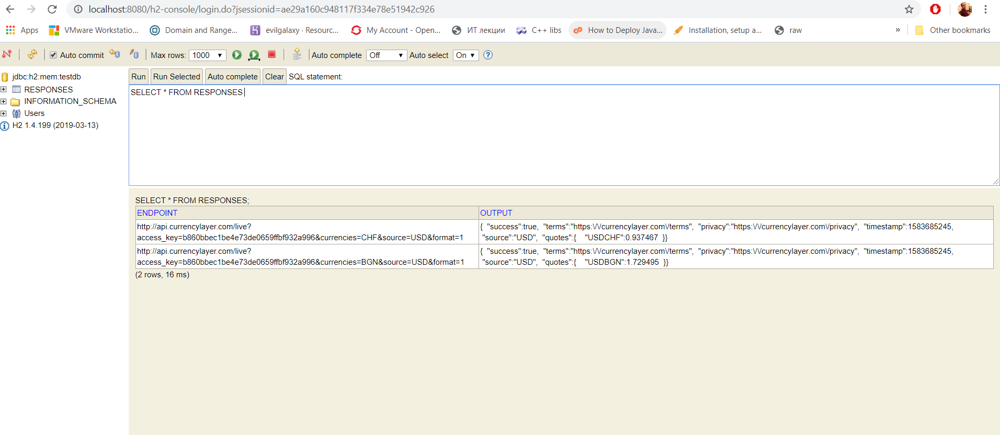
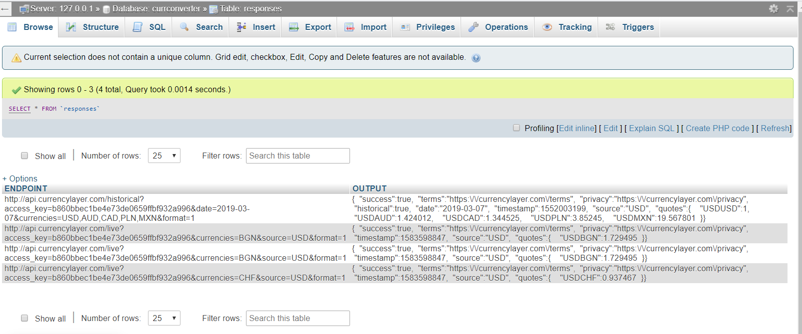
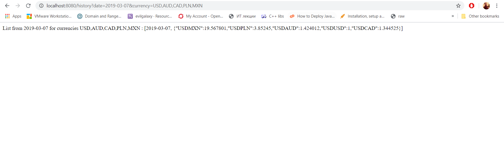

# Currency Converter
Spring Boot app for simple foreign exchange, using an API provider

# How to use:

## With H2 in-memory DB: 
Run the applcation from within your preffered IDE. On startup a DB table, called RESPONSES, is created. Yon can access it under **http://localhost:8080/h2-console/login.do**

## With MySql DB: 
Create MySql database, called **currconverter**, with table **responses** and columns **ENDPOINT** (VARCHAR 500) and **OUTPUT** (VARCHAR 500), using PhpMyAdmin or another DB manager. Then set DB username & pass to **root** in your **config.inc.php** (for PhpMyAdmin) or modify the credentials within the **DbConnWithMySql.java** class to match your DB credentials. You can use XAMPP as a convinient way to setup your DB.

## If no DB is configured and/or you dont have an IDE: 
Just double-click the pre-built JAR artifact, that is on top level inside the app dir. Then access Localhost on port **8080** with the following possible endpoints (if you want to address another port, do it within the **application.properties** under the **resources** folder) :

**localhost:8080/exchange** - to see the current exchange course for the specified currency. The source is always USD, as per limitations in the service provider. Test sample: **http://localhost:8080/exchange?source=USD&target=BGN**

**localhost:8080/history** - to see the exchange course for the specified currency to a certain date in the past. The source is always USD, as per limitations in the service provider. Test sample: **http://localhost:8080/history?date=2019-03-07&currency=USD,AUD,CAD,PLN,MXN**

**localhost:8080/convert** - to convert a specified amount for the specified currency. The source is always USD, as per limitations in the service provider. **!!The current subscription plan does not support this operation, error handler was implemented!!** Test sample: **http://localhost:8080/convert?source=USD&target=PLN&amount=100**

# How to build:
If using **Eclipse**, paste the Maven project into your workspace, import it from there and build it (use **clean package** as Maven goals). Inside the Target folder a runnable artifact will be generated. Copy it to the project root folder and run it from there, or just run the entire project in Eclipse. 
* **NOTE:** If using **IntelliJ Idea**, convert the project to Idea project and use following article, if needed: **https://www.jetbrains.com/help/idea/convert-a-regular-project-into-a-maven-project.html**

# Examples:
