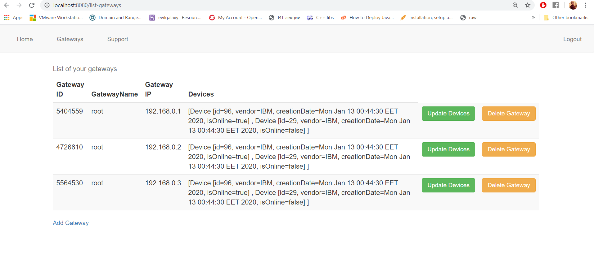

# Gateway Manager
Spring Boot app for managing multiple gateways (masters) and their associated devices (slaves)

## How to use:
1. If using **Eclipse**, paste the Maven project into your workspace, import it from there and build it (use Clean Package as Maven goals). Inside the Target folder a runnable artifact will be generated. Copy it to root folder and run it from CMD, or run the entire project in Eclipse. 
* **NOTE:** If using **IntelliJ Idea**, convert the project to Idea project and use following article, if needed: https://www.jetbrains.com/help/idea/convert-a-regular-project-into-a-maven-project.html .
2. Create MySql database, called **gwmanager**, with table **devices**, which columns are **GATEWAY** (VARCHAR 50) and **DEVICES** (VARCHAR 255, preferably more), using PhpMyAdmin or another DB manager.
3. Set DB username & pass to **root** in your **config.inc.php** (for PhpMyAdmin) or modify the credentials within the **DbConn.java** class to match your DB credentials.
4. Run the project on Localhost with port **8080**. If you want to address another port, do it within the **application.properties** under the **resources** folder.
5. Run the DB on Localhost with port **3306**.
6. Use following credentials for browser login:
  * User: **root**
  * Pass: **root**

## Tips & Tricks:
* If you want to delete a specific device, add following URL parameter **/delete-device?id=** and type the desired device ID right after the **=** sign (Example: **localhost:8080/delete-device?id=11**) .
* You can use XAMPP as a convinient way to setup your DB on local server.

## Screenshots

