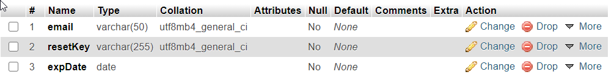

# Custom website for web technologies

## Current URL: http://thatbaddesign.freevar.com/

## I. How to deploy

### 1. Manual setup
- Install PHP CLI   
- Install Apache webserver  
- Install MySQL database as a service  
- In CMD type php -S localhost:8080   
- Access the localhost:8080/index.php in your browser   

NB: Port numbers could vary, depends on your preferences

### 2. Using XAMPP 
- Install XAMPP    
- Turn on the 'Apache' and 'MySQL' services in your Xampp control panel   
- Put the web site resources into c:\xampp\htdocs ( C or whatever drive it exists in)  
- Access the localhost:8080/index.php in your browser   

NB: port number could vary, depends on your preferences  

## II. Setup DB
- Create DB, called **phpwebsite**, with tables **users**, having following structure:

and **password_reset_temp**, having following structure: 

in order to store your users details and the temp keys, that are generated on password reset  

**IMPORTANT: Set the length for the PASSWORD column to 255 and always set a default value to INT columns, that are not PK!**  

NB: You can also create your own collection of avatars under the **uploads** folder

## III. Setup SMTP server
- You can use the **hMailServer** app, in order to prepare your own SMTP Sever and to dispatch emails on user events
- For this project I use the **PHPMailer** library

NB: Set the SMTP settings in your hMailServer and your **php.ini**

## IV. Authentication
- You can also authenticate, using a password, or a mobile app for scanning QR codes plus  
another one for the generation of a one-time pass code
- For this project I use the **sonata-project/GoogleAuthenticator** library
